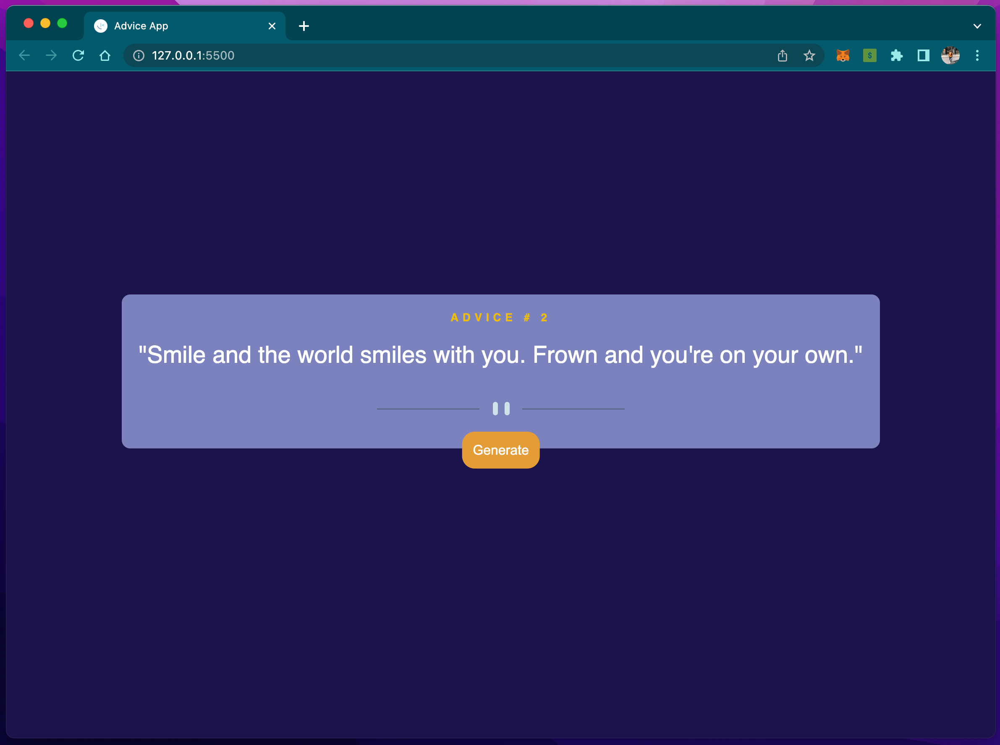

# Advice generator app

The project is inspired by [Advice generator app challenge on Frontend Mentor](https://www.frontendmentor.io/challenges/advice-generator-app-QdUG-13db). Frontend Mentor is a website featuring challenges that will help you improve your coding skills by building realistic projects.

## Table of contents

- [Overview](#overview)
  - [The Project](#the-project)
  - [Screenshot](#screenshot)
  - [Links](#links)
- [My process](#my-process)
  - [Built with](#built-with)
  - [What I learned](#what-i-learned)
  - [Continued development](#continued-development)
  - [Useful resources](#useful-resources)
- [Author](#author)
- [Acknowledgments](#acknowledgments)

## Overview

### The Project

Users should be able to:

- View the optimal layout for the app depending on their device's screen size
- See hover states for all interactive elements on the page
- Generate a new piece of advice by clicking the generator button

### Screenshot

### Links

- Solution URL: [Add solution URL here](https://your-solution-url.com)
- Live Site URL: [Add live site URL here](https://your-live-site-url.com)

## My process

### Built with

- Semantic HTML5 markup
- CSS
- Flexbox
- Vanilla JS
- API

### What I learned

One of the major things I learnt or in other words enforced was my Javascript fundimentals. I got to work with Template strings, fetching API's, Arrow functions & structure.  

### Continued development

As I continue to explore the deeper parts of Javascript, I plan to focus more on learning about API's, design patterns and other areas within the subject. There are probably a few concepts that I'm not completely comfortable with yet but I want to take the time and sharpen them. I will also probably go back and see if I can improve each projects that I do.

### Useful resources

- [Frontendmentor.io](https://www.frontendmentor.io) - This website helped me to get an idea of the project to challenge myself with.

## Author

- Linkedin - [Mass Jack](https://www.linkedin.com/in/massjack)
